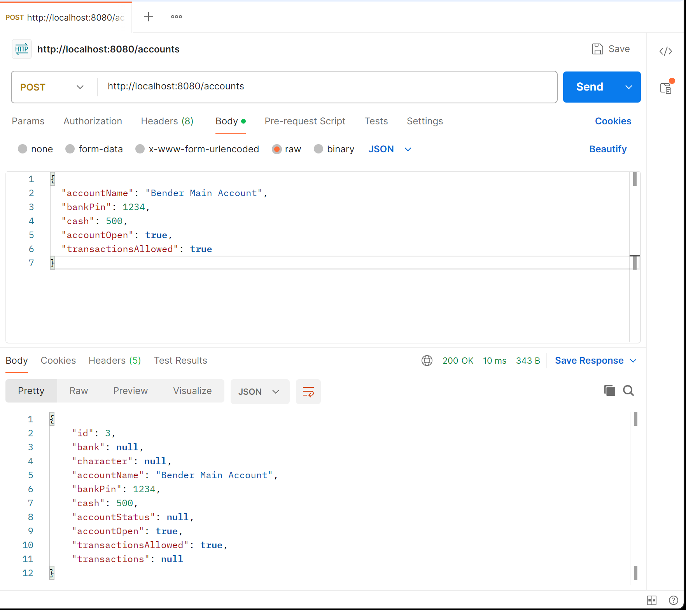
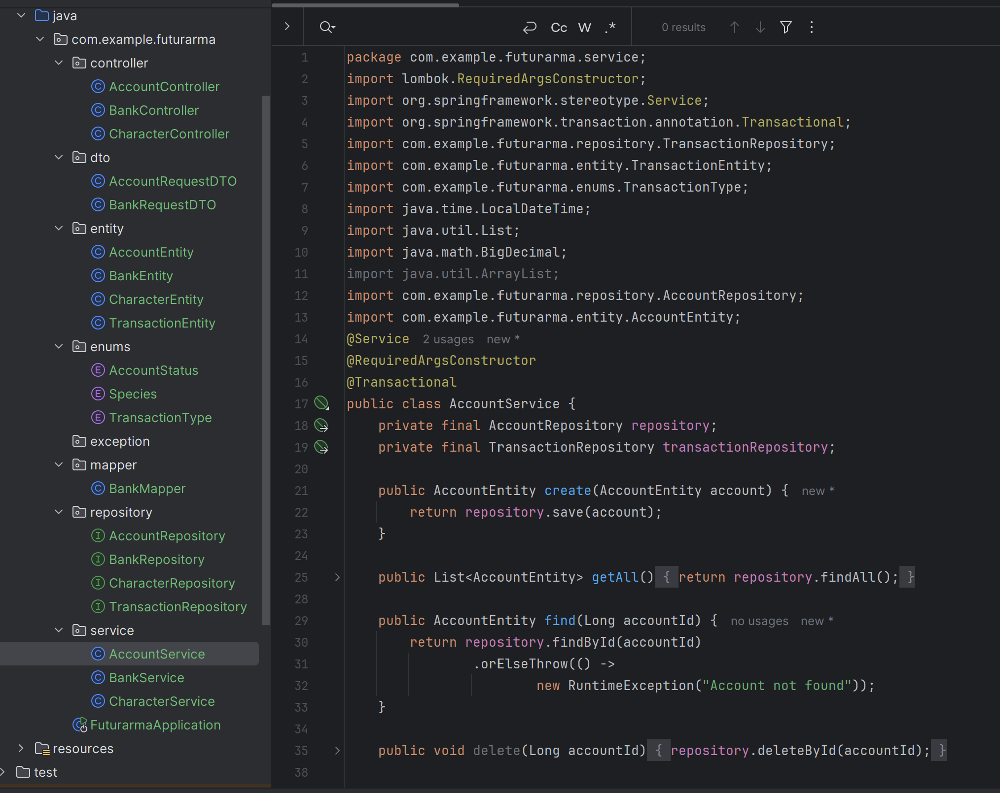

# 🏦 Futurama Banking API

## 📌 Description

A Spring Boot REST API for managing bank accounts and financial transactions, including deposits, withdrawals, and transfers.

This project demonstrates backend development skills such as RESTful API design, layered architecture, and transaction handling.

---

## 🚀 Features

- Create bank accounts
- Deposit money
- Withdraw funds
- Transfer money between accounts
- Track transaction history
- RESTful API design
- Layered architecture (Controller, Service, Repository)

---

## 🛠️ Tech Stack

- Java
- Spring Boot
- Spring Data JPA
  - Hibernate   
- Maven
- Postman

---

## ▶️ Running the Project

Start the application using:

```bash
mvn spring-boot:run
```

---

## 📸 Screenshots

### 🆕 Create Account Endpoint


### 💸 Withdraw and Deposit Operations


### 🏗️ Project Structure


---

## 📚 What I Learned

Through this project I improved my understanding of:

- REST API development
- Transaction handling
- Spring Boot architecture
- Layered backend design
- Database persistence with JPA/Hibernate
- API testing with Postman

---

## 👨‍💻 Author

Peter-c-dev
